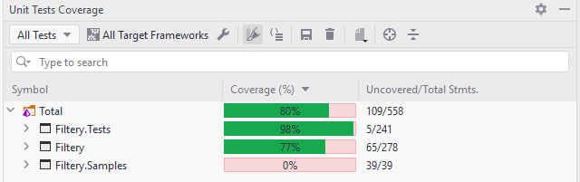

  

Simple Lambda Expression base Filtering, Sorting and Paging  library.

[](https://badge.fury.io/nu/Filtery)   

#### Features:
- "Key" > "Filter Query" and "Operation "mapping for search
- "Key" > "Order Property" matching
- You are free to write Filter Operation matched filter query 
- Paging Support

#### Supported Filter Operations:
- Equal
- NotEqual
- Contains
- GreaterThan
- LessThan
- GreaterThanAndEqual
- LessThanAndEqual
- StartsWith
- EndsWith

#### Supported Order Operations:
- Ascending
- Descending

#### Usages:

##### Model:

```cs
public class User
{
    public Guid Id { get; set; }
    public string FirstName { get; set; }
    public string LastName { get; set; }
    public int Age { get; set; }
    public bool HasDriverLicence { get; set; }
    public DateTime Birthdate { get; set; }
    public Address Address { get; set; }
    public List<string> ParentNames { get; set; }
}

public class Address
{
    public string Country { get; set; }
    public string City { get; set; }
}
```

##### Filter Mapping File:

You should mark the place where the filtering value should come from in the filtering query with the correct data type in the "FilteryQueryValueMarker". The filtering value you sent will be automatically replace there.

###### FilteryQueryValueMarker Types
* FilterStringValue          
* FilterCharValue            
* FilterCharNullableValue    
* FilterShortValue           
* FilterNullableShortValue
* FilterByteValue            
* FilterNullableByteValue    
* FilterIntValue             
* FilterNullableIntValue
* FilterLongValue      
* FilterNullableLongValue
* FilterFloatValue     
* FilterNullableFloatValue
* FilterDecimalValue   
* FilterNullableDecimalValue
* FilterDoubleValue    
* FilterNullableDoubleValue
* FilterDateTimeValue  
* FilterNullableDateTimeValue
* FilterBooleanValue         
* FilterNullableBooleanValue
* FilterGuidValue
* FilterNullableGuidValue

```cs
public class UserFilteryMappings : IFilteryMapping<User>
{
    public void FilteryMappings(FilteryMapper<User> mapper)
    {
        mapper
            .Name("name")
            .OrderProperty(p =>p.FirstName)
            .Filter(p => p.FirstName.ToLower().Equals(FilteryQueryValueMarker.FilterStringValue.ToLower()), FilterOperation.Equal)
            .Filter(p => !p.FirstName.ToLower().Equals(FilteryQueryValueMarker.FilterStringValue.ToLower()), FilterOperation.NotEqual)
            .Filter(p => p.FirstName.ToLower().Contains(FilteryQueryValueMarker.FilterStringValue.ToLower()), FilterOperation.Contains)
            .Filter(p => p.FirstName.ToLower().StartsWith(FilteryQueryValueMarker.FilterStringValue.ToLower()), FilterOperation.StartsWith)
            .Filter(p => p.FirstName.ToLower().EndsWith(FilteryQueryValueMarker.FilterStringValue.ToLower()), FilterOperation.EndsWith);

        mapper
            .Name("age")
            .OrderProperty(p => p.Age)
            .Filter(p => p.Age == FilteryQueryValueMarker.FilterIntValue, FilterOperation.Equal)
            .Filter(p => p.Age != FilteryQueryValueMarker.FilterIntValue, FilterOperation.NotEqual)
            .Filter(p => p.Age > FilteryQueryValueMarker.FilterIntValue, FilterOperation.GreaterThan)
            .Filter(p => p.Age < FilteryQueryValueMarker.FilterIntValue, FilterOperation.LessThan)
            .Filter(p => p.Age >= FilteryQueryValueMarker.FilterIntValue, FilterOperation.GreaterThanOrEqual)
            .Filter(p => p.Age <= FilteryQueryValueMarker.FilterIntValue, FilterOperation.LessThanOrEqual);
        
        mapper
            .Name("date")
            .OrderProperty(p => p.Birthdate)
            .Filter(p => p.Birthdate == FilteryQueryValueMarker.FilterDateTimeValue, FilterOperation.Equal)
            .Filter(p => p.Birthdate != FilteryQueryValueMarker.FilterDateTimeValue, FilterOperation.NotEqual)
            .Filter(p => p.Birthdate > FilteryQueryValueMarker.FilterDateTimeValue, FilterOperation.GreaterThan)
            .Filter(p => p.Birthdate < FilteryQueryValueMarker.FilterDateTimeValue, FilterOperation.LessThan)
            .Filter(p => p.Birthdate >= FilteryQueryValueMarker.FilterDateTimeValue, FilterOperation.GreaterThanOrEqual)
            .Filter(p => p.Birthdate <= FilteryQueryValueMarker.FilterDateTimeValue, FilterOperation.LessThanOrEqual);

        mapper
            .Name("licence")
            .OrderProperty(p => p.HasDriverLicence)
            .Filter(p => p.HasDriverLicence == FilteryQueryValueMarker.FilterBooleanValue, FilterOperation.Equal)
            .Filter(p => p.HasDriverLicence != FilteryQueryValueMarker.FilterBooleanValue, FilterOperation.NotEqual);
        
        mapper
            .NameWithoutOrder("parentnames")
            .Filter(p => p.ParentNames.Contains(FilteryQueryValueMarker.FilterStringValue), FilterOperation.Contains);
        
        mapper
            .Name("id")
            .OrderProperty(p => p.Id)
            .Filter(p => p.Id == FilteryQueryValueMarker.FilterGuidValue, FilterOperation.Equal)
            .Filter(p => p.Id != FilteryQueryValueMarker.FilterGuidValue, FilterOperation.NotEqual);

    }
}
```

##### MVC Flow Usage Sample:

```cs
// ConfigureServices setting for MVC flow (AddNewtonsoftJson())
public void ConfigureServices(IServiceCollection services)
{
	services.AddControllers().AddNewtonsoftJson();
}


[HttpGet]
public JsonResult GetUsers(FilteryRequest request) 
{
    var userList = new List<User>();
    userList.Add(new User
    {
        FirstName = "John", 
        LastName = "Doe", 
        Age = 22, 
        HasDriverLicence = true, 
        Birthdate = new DateTime(1987, 06, 06), 
        Address = new Address{Country = "Netherland", City = "Amsterdam"},
        ParentNames = new List<string>{ "Bob", "Sera" }
    });
    userList.Add(new User
    {
        FirstName = "Alisa", 
        LastName = "Doe", 
        Age = 18, 
        HasDriverLicence = true, 
        Birthdate = new DateTime(1997, 09, 27), 
        Address = new Address{Country = "Mexico", City = "Merida"},
        ParentNames = new List<string>{ "Fernando", "Elena" }
    });

    var response = userList.BuildFiltery(new UserFilteryMappings(), filteryQuery).ToList();

    return Json(response);
}

```

##### Usage Sample:

```cs
var userList = new List<User>();
userList.Add(new User
{
    Id = Guid.NewGuid(),
    FirstName = "John", 
    LastName = "Doe", 
    Age = 22, 
    HasDriverLicence = true, 
    Birthdate = new DateTime(1987, 06, 06), 
    Address = new Address{Country = "Netherland", City = "Amsterdam"},
    ParentNames = new List<string>{ "Bob", "Sera" }
});
userList.Add(new User
{
    Id = Guid.NewGuid(),
    FirstName = "Alisa", 
    LastName = "Doe", 
    Age = 18, 
    HasDriverLicence = true, 
    Birthdate = new DateTime(1997, 09, 27), 
    Address = new Address{Country = "Mexico", City = "Merida"},
    ParentNames = new List<string>{ "Fernando", "Elena" }
});

var filteryQuery = new FilteryRequest
{
    //string
    // AndFilters = new List<FilterItem>
    // {
    //     new FilterItem {TargetFieldName = "name", Value = "john", Operation = FilterOperation.Equal},
    //     new FilterItem {TargetFieldName = "name", Value = "alisa", Operation = FilterOperation.NotEqual},
    //     new FilterItem {TargetFieldName = "name", Value = "john", Operation = FilterOperation.Contains},
    //     new FilterItem {TargetFieldName = "name", Value = "john", Operation = FilterOperation.StartsWith},
    //     new FilterItem {TargetFieldName = "name", Value = "john", Operation = FilterOperation.EndsWith}
    // },
    
    //integer
    // AndFilters = new List<FilterItem>
    // {
    //     new FilterItem {TargetFieldName = "age", Value = 18, Operation = FilterOperation.Equal},
    //     new FilterItem {TargetFieldName = "age", Value = 22, Operation = FilterOperation.NotEqual},
    //     new FilterItem {TargetFieldName = "age", Value = 6, Operation = FilterOperation.GreaterThan},
    //     new FilterItem {TargetFieldName = "age", Value = 22, Operation = FilterOperation.LessThan},
    //     new FilterItem {TargetFieldName = "age", Value = 6, Operation = FilterOperation.GreaterThanOrEqual},
    //     new FilterItem {TargetFieldName = "age", Value = 22, Operation = FilterOperation.LessThanOrEqual}
    // },
    
    //datetime
    // AndFilters = new List<FilterItem>
    // {
    //     new FilterItem {TargetFieldName = "date", Value = new DateTime(1987, 06, 06), Operation = FilterOperation.Equal},
    //     new FilterItem {TargetFieldName = "date", Value = DateTime.Now, Operation = FilterOperation.NotEqual},
    //     new FilterItem {TargetFieldName = "date", Value = new DateTime(1980, 06, 06), Operation = FilterOperation.GreaterThan},
    //     new FilterItem {TargetFieldName = "date", Value = DateTime.Now, Operation = FilterOperation.LessThan},
    //     new FilterItem {TargetFieldName = "date", Value = new DateTime(1980, 06, 06), Operation = FilterOperation.GreaterThanOrEqual},
    //     new FilterItem {TargetFieldName = "date", Value = DateTime.Now, Operation = FilterOperation.LessThanOrEqual}
    // },
    
    //bool
    // AndFilters = new List<FilterItem>
    // {
    //     new FilterItem {TargetFieldName = "licence", Value = true, Operation = FilterOperation.Equal},
    //     new FilterItem {TargetFieldName = "licence", Value = false, Operation = FilterOperation.NotEqual}
    // },
    
    //Navigation Property String List
    //OrFilters = new List<FilterItem>
    //{
    //    new FilterItem {TargetFieldName = "parentnames", Value = "Sera", Operation = FilterOperation.Contains}
    //},

    //Guid
    AndFilters = new List<FilterItem>
    {
        new FilterItem {TargetFieldName = "id", Value = userList.First().Id, Operation = FilterOperation.Equal}
    },
    
    OrderOperations = new Dictionary<string, OrderOperation>
    {
        {"name", OrderOperation.Ascending}
    },
    PageNumber = 1,
    PageSize = 2
};

var response = userList.BuildFiltery(new UserFilteryMappings(), filteryQuery);
Console.WriteLine(response.PageNumber);
Console.WriteLine(response.PageSize);
Console.WriteLine(response.TotalPageCount);

var responseQueryable = userList.AsQueryable().BuildFiltery(new UserFilteryMappings(), filteryQuery);
Console.WriteLine(responseQueryable.PageNumber);
Console.WriteLine(responseQueryable.PageSize);
Console.WriteLine(responseQueryable.TotalPageCount);

```

### Release Notes

##### 1.0.9
* FilterGuidValue and FilterNullableGuidValue marker type added
* System.Linq.Dynamic.Core version updated to 1.2.19

##### 1.0.8
* Query generate flow bug fix

##### 1.0.7
* OrFilters query generate bug fix

##### 1.0.6
* BuildFilteryAsync method added

##### 1.0.5
* Source code refactored
* Page size negative number check added. (When it comes, 0 set for page size)

##### 1.0.4
* BuildFiltery now return FilteryResponse type, it contains
    * Data > filtered response result
    * PageNumber
    * PageSize
    * TotalItemCount
    * TotalPageCount

##### 1.0.3
* 0 and below paging bug fix

##### 1.0.2
* IQueryable support added
* Filter query build bug fixed

##### 1.0.1
* Base exception type added > FilteryBaseException  (deprecated)

##### 1.0.0
* Base releases  (deprecated)

#### Code Coverage
  
